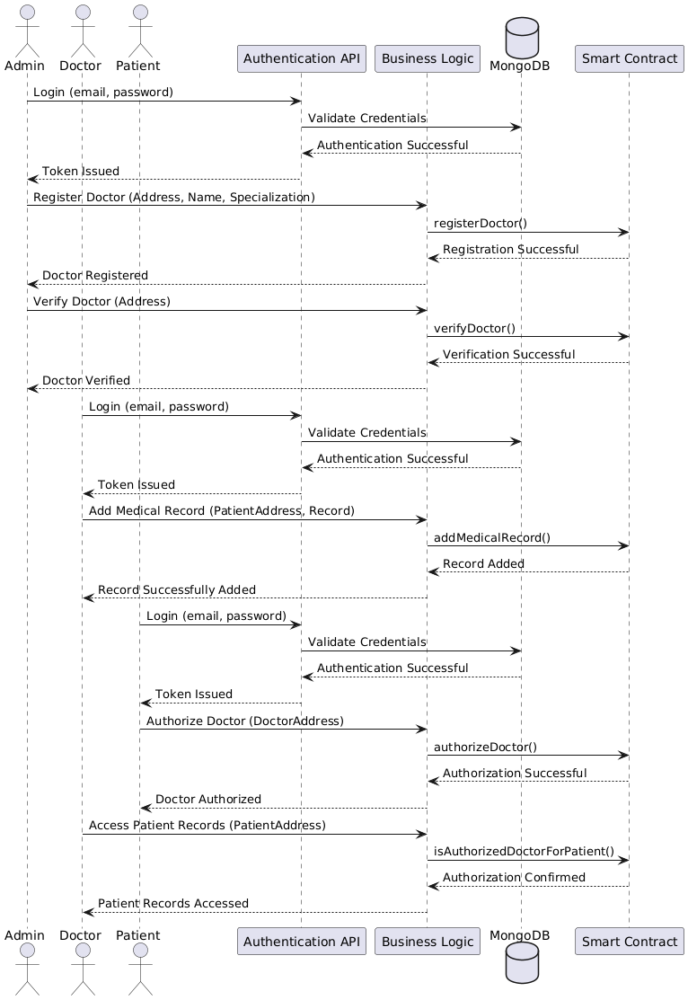
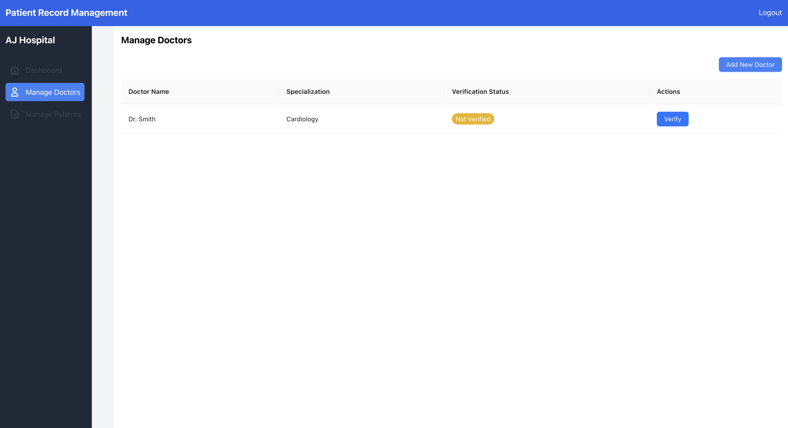

### 1. **Introduction**  
The **Patient Data Management System** is a blockchain-based application designed to enhance the security and accessibility of patient medical records. The system involves three primary roles: Admin, Doctor, and Patient. Admins can register and verify doctors, while patients can authorize verified doctors to access or add their medical records. The solution leverages **Ethereum blockchain**, smart contracts, and decentralized storage to provide a secure and transparent ecosystem.

---

### 2. **Blockchain Design and Concept**

#### Blockchain Type:  
Private blockchain, implemented using **Ganache** for testing and simulation purposes.  

#### Consensus Mechanism:  
The **Proof of Authority (PoA)** mechanism is simulated by Ganache, ideal for private blockchain scenarios.  

#### Cryptocurrency:  
The application leverages **Ethereum** for smart contract deployment and execution.  

#### Key Features:  
- Decentralized storage of medical records.  
- Verification mechanism for doctors to ensure trust.  
- Immutable medical records added by authorized entities.  
- Efficient mapping for patients, doctors, and records.

---

### 3. **Technical Implementation**

#### Data Structure:  
- **Patient**: Contains attributes like address, name, age, medical records (array), authorized doctors (array), and registration timestamp.  
- **Doctor**: Attributes include address, name, specialization, and verification status.  
- **Mapping**: Two mappings to associate Ethereum addresses with `Patient` and `Doctor` structs for quick lookups.  

#### Smart Contracts:  
- **Purpose**: To govern the registration, verification, and access control of medical data.  
- **Functionalities**:  
  - Patient registration.  
  - Doctor registration and verification.
  - Addition of medical records by authorized doctors.  
  - Retrieval of patient records.  

#### Security Measures:  
- **Access Control**: Role-based access control via `onlyAdmin` and `onlyAuthorizedDoctor` modifiers.  
- **Data Integrity**: Immutable medical records stored on the blockchain.  
- **Authorization**: Verification and explicit authorization mechanisms ensure that only trusted doctors can interact with patient data.  

#### Architecture Diagram

#### Sequence Diagram

---

### 4. **Use Case and Application**

#### Real-world Relevance:  
This system addresses the need for secure, transparent, and decentralized management of medical records. It ensures data privacy, allows role-based access, and eliminates intermediaries.  
- **For Doctors**: Verifiable identity and access to accurate patient information.  
- **For Admins**: Centralized management of system roles and trust establishment.  

#### Benefits:  
- Enhanced security and immutability.  
- Improved trust and transparency in medical data management.  
- Efficient collaboration between healthcare providers.  

---

### 5. **Challenges and Solutions**

#### Challenges:  
1. **Efficient Mapping**: Keeping track of all patients and doctors.  
   **Solution**: Used arrays (`patientAddresses`, `doctorAddresses`) to maintain a comprehensive list.  
2. **Access Control**: Preventing unauthorized access to records.  
   **Solution**: Implemented role-based modifiers to restrict access.  
3. **Testing and Simulation**: Managing private blockchain configurations.  
   **Solution**: Used **Ganache-cli** for testing and **Truffle** for deployment and simulation.  

---

### 6. **Testing and Results**

#### Testing Tools:  
- **Ganache**: To simulate the Ethereum blockchain.  
- **Truffle**: For deploying and testing smart contracts.  
- **Postman**: To test API endpoints.  

### UI Screen:  
  
  
  
  
  

### 7. **Conclusion**

The **Patient Data Management System** demonstrates a robust and secure method for managing medical records using blockchain technology. By leveraging **smart contracts**, the system provides role-based access control and ensures data integrity. Future improvements could include implementing decentralized storage solutions (like IPFS) for large medical files and transitioning to a production-ready blockchain network.

---

### 8. **References**  
- [Solidity Documentation](https://docs.soliditylang.org/)  
- [Ganache Documentation](https://trufflesuite.com/ganache/)  
- [Truffle Documentation](https://trufflesuite.com/truffle/)  
- Ethereum: [https://ethereum.org](https://ethereum.org)  

#### Deployment Instructions  
1. Start Ganache with `ganache-cli`.  
2. Compile and deploy contracts using Truffle: `truffle compile && truffle migrate`.  
3. Run the Node.js server for API handling.  
4. Use React front-end to interact with the system.  